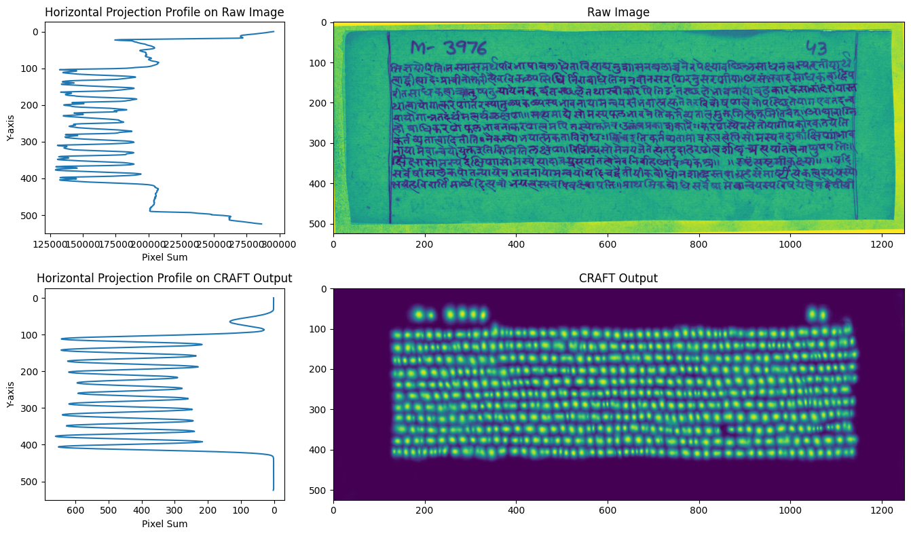

# CRAFT Powered Line-Segmentation

## Overview
Robustly segmenting the text lines from a wide variety of Page Layouts (eg: newspapers, books, comics, receipts, manuscripts) is a hard problem. On the other hand, segmenting text lines from fully standardized page layouts has been solved (eg: Form-4A, Government of XYZ). 

Our method builds on the [CRAFT model](https://github.com/clovaai/CRAFT-pytorch) and finds a middle ground that enables us to segment text lines from documents which meet a selection criteria, but also handles variations within them. 

**Our primarly learning is that it is easier segment text lines using projection-profile based approches when the raw images are first passed through CRAFT to convert them into heatmaps. In other words, it is easier to work with CRAFT outputs(heatmaps) as compared to raw images.**



Given the lack of robustness in Neural Networks, end-to-end fully generalized layout analysis for text line segmentation is not currently feasible. 

Most methods use some combination of AI (matrix multiplication followed by non-linearities) and algorithmic reasoning with thresholds (if/else statement) to segement text lines. 
- We believe that CRAFT should be the AI part of the solution - whose job is to robustly convert any characters present on a page to heat maps - with the presence of a character being hot. 
- We can then work with these heatmaps and flexibly tweak the algorithmic logic based on what the selection criteria of the target documents is (eg: single column, two column, news paper).


Below we find the selection criteria for the manuscripts which the code in this repository will robustly handle:
- we restrict ourselves to working with non-pictorial, single-column text manuscripts
- we require each line of the manuscript to run from left all the way to the right, and not stop somewhere in between.

Other variations such as page size, curvy, handwritten lines, handwriting style, variation and size, calligraphy, ornamentation, page texture, and page color will be handle by CRAFT. It is also feasible to automatically detect pages which do not meet this selection criteria by doing anomaly detection on the heatmaps.

## Getting Started
 1) Clone this repo: ```git clone https://github.com/flame-cai/line-segmentation.git```
 2) Create conda enviroment ```conda env create --name envname --file=requirements.yml```
 3) Create a folder ```input_images/YOUR_MANUSCRIPT_NAME```
 4) Set the ```craft_fork_v5.ipynb``` kernel to the conda environment ```envname```
 5) Update the manuscript name in ```craft_fork_v5.ipynb``` with ```YOUR_MANUSCRIPT_NAME```
 6) Run all cells of ```craft_fork_v5.ipynb```
